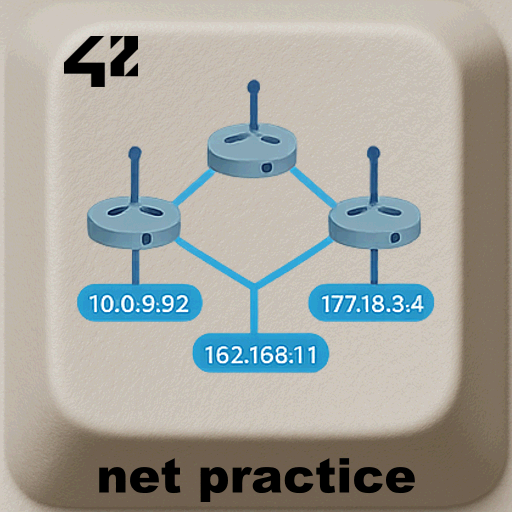
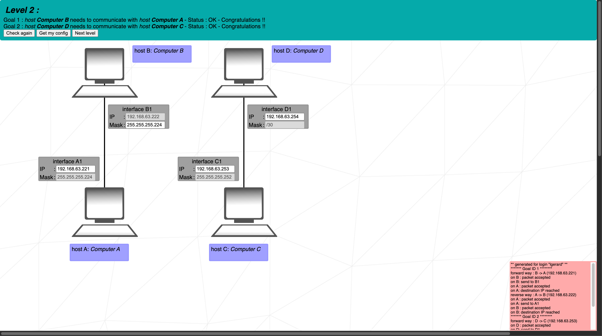

# Net Practice – 42 project

<div align="center">
  <h2>NetPractice – Networking Basics</h2>
  
  <br>
</div>


> **NetPractice** is an interactive networking exercise.  
> It introduces the fundamentals of **IPv4 addressing, subnetting, and routing**.

---

## 📖 Table of Contents
- [Description](#-description)
- [Features](#-features)
- [Installation](#%EF%B8%8F-installation)
- [Usage](#-usage)
- [Project Structure](#-project-structure)
- [Examples](#-examples)
- [Roadmap](#-roadmap)
- [Credits](#-credits)
- [License](#-license)

---

## 📝 Description
NetPractice is a browser-based simulator provided by 42.  
You solve a series of **network configuration exercises** by assigning IP addresses, subnet masks, and gateways.  

---

## ✨ Features
- ✅ IPv4 addressing.  
- ✅ Subnetting and masks.  
- ✅ Routing through gateways.  
- ✅ Step-by-step exercises with increasing difficulty.  

---

## ⚙️ Installation
Nothing to install – the simulator is provided by 42 and cannot be redistributed.

---

## 🖥 Usage

Each level consists of a `.json` configuration file and a `.png` network diagram containing my solutions.
Open the `.json` with any text editor and the `.png` with an image viewer to review the solution.

---

## 📂 Project Structure

```
.
├── img/                # Content for README
├── results/            # json files and screen shots of the 10 levels accomplished
├── fr.subject.pdf      # Subject file
├── LICENSE.txt          # License MIT
└── README.md
```

---

## 🔎 Examples

```bash
$ cat net_practice/results/level2.json
{"routes":{},"ifs":{"A1":{"ip":"192.168.63.221"},"B1":{"mask":"255.255.255.224"},"C1":{"ip":"192.168.63.253"},"D1":{"ip":"192.168.63.254"}}}%
```



---

## 🚀 Roadmap
This project is the original version that was evaluated at 42 and will remain in this state.  

---
## 👤 Credits
Project solved by **Loïc Gérard** – student at [École 42 Perpignan](https://42perpignan.fr).  

---

## 📜 License
MIT License – see the [LICENSE.txt](./LICENSE.txt) file for details.
